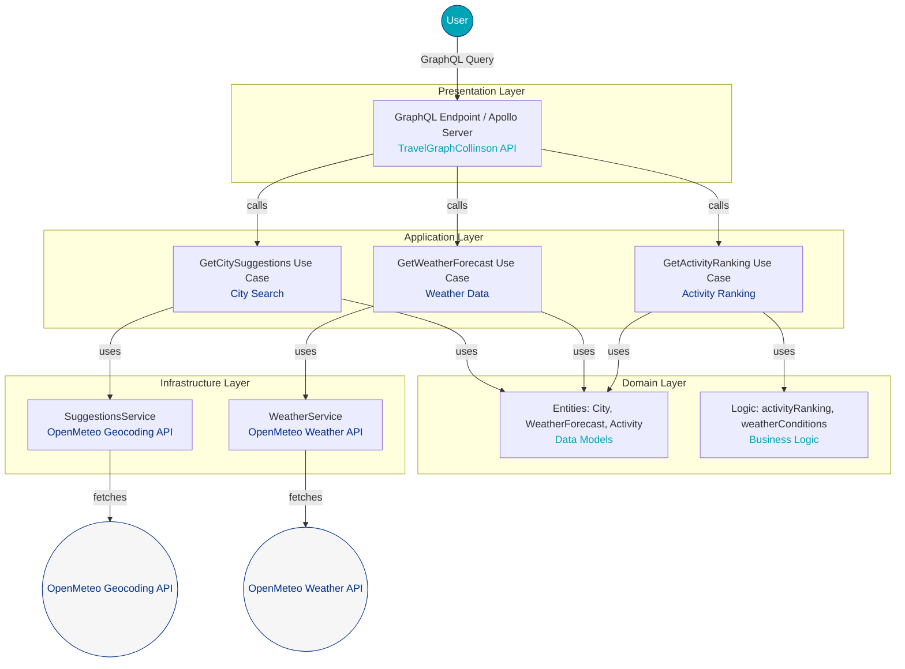

# 🌦️ **TravelGraphCollinson: Weather-Based Activity Recommender**

  
Welcome to **TravelGraphCollinson**, a sophisticated GraphQL-based API that delivers personalized activity recommendations based on real-time weather conditions and city-specific data. Designed with a clean architecture, this system integrates with OpenMeteo APIs for geocoding and weather forecasts, offering users tailored suggestions for indoor and outdoor activities. The API name reflects its focus on **travel**, powered by **GraphQL**, and styled with the professional aesthetic of the **Collinson Group** website, using a color palette of **navy blue**, **teal**, **white**, and **light grey**.

---

## 🎯 **Purpose**

The **TravelGraphCollinson** API empowers users to plan their travel and leisure activities by recommending activities that align with current weather conditions in their chosen city. Whether you're a traveler seeking outdoor adventures or indoor experiences, this system ensures recommendations are precise, weather-aware, and location-specific. Built with scalability and maintainability in mind, it leverages GraphQL's declarative data fetching to minimize over- or under-fetching, ensuring efficient and flexible API interactions.[](https://graphql.org/)

---

## 🌟 **Key Features**

- **Real-Time Weather Integration**: Fetches live weather data from OpenMeteo to inform activity rankings.
- **Smart Activity Ranking**: Uses a weighted scoring system to rank activities based on temperature, weather conditions, and activity suitability (e.g., skiing for snowy conditions, surfing for warm and clear days).
- **GraphQL-Powered**: Provides a single endpoint for flexible, client-driven queries, reducing network overhead.[](https://en.wikipedia.org/wiki/GraphQL)
- **City Suggestions**: Suggests cities using OpenMeteo's geocoding API for seamless location-based planning.
- **Collinson-Inspired Design**: Adopts the professional and clean aesthetic of the Collinson Group website, with a color scheme of **navy blue (#003087)**, **teal (#00A4B4)**, **white (#FFFFFF)**, and **light grey (#F5F6F5)** for UI components or documentation styling.
- **Extensible Architecture**: Modular design allows easy addition of new activities, weather factors, or data sources.

---

## 🏗️ **System Architecture**

The system follows a **clean architecture** approach, separating concerns into distinct layers for maintainability and scalability. Below is a flowchart illustrating the architecture:



### **Architecture Breakdown**

- **Presentation Layer**: Hosts the **TravelGraphCollinson** GraphQL endpoint using Apollo Server, serving as the entry point for client queries. Styled with Collinson's **navy blue** and **teal** for a professional look.[](https://www.apollographql.com/docs/react/data/operation-best-practices)
- **Application Layer**: Contains use cases for city suggestions, weather forecasts, and activity ranking, orchestrating business logic and external service calls.
- **Domain Layer**: Defines core entities (`City`, `WeatherForecast`, `Activity`) and business logic (e.g., activity ranking algorithm), ensuring weather-aware recommendations.
- **Infrastructure Layer**: Integrates with OpenMeteo APIs for geocoding and weather data, handling external data fetching.

---

## 🚀 **How It Works**

1. **City Selection**: Users query the API for city suggestions via the `GetCitySuggestions` use case, powered by OpenMeteo's geocoding API.
2. **Weather Data Retrieval**: The `GetWeatherForecast` use case fetches real-time weather data (temperature, condition, etc.) for the selected city.
3. **Activity Ranking**: The `GetActivityRanking` use case applies a weighted scoring system to rank activities (e.g., Skiing, Surfing, Indoor/Outdoor Sightseeing) based on weather factors like temperature and condition. The algorithm is:

   - **Rule-Based & Configurable**: Each activity is associated with a set of ranking rules, defined in [`src/utils/activityRules.ts`](src/utils/activityRules.ts). Each rule specifies:
     - `condition`: The weather condition (e.g., 'snow', 'clear', 'rain', etc.)
     - `temperatureRange` (optional): The range of temperatures for which the rule applies
     - `points`: The score to add if the rule matches
   - **How it works:**
     1. For each activity, all matching rules are checked against the current weather condition and temperature.
     2. If a rule matches, its points are added to the activity's score.
     3. After all rules are applied, activities are sorted in descending order of total points.
     4. The sorted list is returned, with each activity assigned a rank (1 = most recommended).
   - **Example:**
     - If the weather is `snow` and temperature is 10°C, the rule `{ condition: 'snow', temperatureRange: [-Infinity, 15], points: 12 }` will apply to "Skiing", giving it a high score.
     - If the weather is `clear` and temperature is 32°C, "Surfing" and "Outdoor Sightseeing" will both get points, but "Surfing" may be ranked higher based on the rule weights.
   - **Easy to Extend:**
     - To add or tune activities, simply edit the rules in [`activityRules.ts`](src/utils/activityRules.ts) without touching business logic code.

4. **GraphQL Response**: Returns a ranked list of activities in a flexible, client-specified format, adhering to GraphQL's declarative data fetching principles.[](https://en.wikipedia.org/wiki/GraphQL)

---

## 🛠️ **Usage Example**

### GraphQL Query

```graphql
query ActivityRanking($temperature: Float!, $weatherCode: Int!) {
  activityRanking(temperature: $temperature, weatherCode: $weatherCode) {
    name
    ranking
  }
}
```

### Variables

```json
{
  "weatherCode": 0,
  "temperature": 28
}
```

### Sample Response

```json
{
  {
  "data": {
    "activityRanking": [
      {
        "name": "Outdoor Sightseeing",
        "ranking": 1
      },
      {
        "name": "Hiking",
        "ranking": 2
      },
      {
        "name": "Surfing",
        "ranking": 3
      },
      {
        "name": "Skiing",
        "ranking": 4
      },
      {
        "name": "Indoor Sightseeing",
        "ranking": 5
      },
      {
        "name": "Museum Visit",
        "ranking": 6
      }
    ]
  }
}
}
```

---

## 🎨 **Color Scheme**

The **TravelGraphCollinson** API and its documentation adopt the Collinson Group website's color palette for a cohesive and professional aesthetic:

- **Navy Blue (#003087)**: Primary color for headers, backgrounds, and key UI elements.
- **Teal (#00A4B4)**: Accent color for buttons, links, and highlights.
- **White (#FFFFFF)**: Backgrounds and text for clean readability.
- **Light Grey (#F5F6F5)**: Secondary backgrounds and subtle borders.

This palette ensures a modern, trustworthy, and visually appealing experience, aligning with Collinson Group's branding.

---

## 🔧 **Setup Instructions**

1. **Clone the Repository**:

   ```bash
   git clone https://github.com/manny1001/travel-graph-collinson.git
   cd travelgraphcollinson
   ```

2. **Install Dependencies**:

   ```bash
   npm install
   ```

3. **Configure Environment**:
   Create a `.env` file with OpenMeteo API endpoints:

   ```env
   OPENMETEO_GEOCODING_API=https://api.open-meteo.com/v1/geocoding
   OPENMETEO_WEATHER_API=https://api.open-meteo.com/v1/forecast
   ```

4. **Run the Server**:

   ```bash
   npm start
   ```

   The GraphQL endpoint will be available at `http://localhost:4000/graphql`.

5. **Explore the API**:
   Use tools like **GraphiQL** or **Postman** to test queries at the `/graphql` endpoint.[](https://en.wikipedia.org/wiki/GraphQL)

---

## 🌐 **Extending the System**

The **TravelGraphCollinson** API is designed for extensibility:

- **Add New Activities**: Update the `activityPreferences` configuration in `activityRanker.ts` to include new activities with their ideal conditions.
- **Incorporate Additional Weather Factors**: Extend the `WeatherFactors` interface to include parameters like wind speed or humidity.
- **Integrate New Data Sources**: Add services in the Infrastructure Layer to connect to other APIs (e.g., travel itinerary APIs like Alpaca Travel).[](https://github.com/AlpacaTravel/graphql-docs)
- **Custom Styling**: Adjust UI components to further align with Collinson Group's branding by tweaking CSS variables to match the color palette.

---

## 📚 **Resources**

- **OpenMeteo APIs**: [Geocoding](https://open-meteo.com/en/docs/geocoding-api) | [Weather Forecast](https://open-meteo.com/en/docs)
- **GraphQL Documentation**: [Official GraphQL Docs](https://graphql.org/)[](https://graphql.org/)
- **Collinson Group Branding**: [Collinson Group Website](https://www.collinsongroup.com/)
- **Apollo Server**: [Documentation](https://www.apollographql.com/docs/apollo-server/)[](https://www.apollographql.com/docs/react/data/operation-best-practices)
- **API Playground**: Test queries in a GraphQL playground at `http://localhost:4000/graphql` after setup.

---

## ⚖️ **Omissions & Trade-offs**

**What was omitted or simplified, and why:**

- **Limited Activity Set:** Only the four specified activities (Skiing, Surfing, Indoor/Outdoor Sightseeing) are supported. This keeps the scope focused and manageable for the test duration.
- **Simple Rule-Based Ranking:** Activity ranking uses a rule-based system (configurable rules per activity) rather than a machine learning or data-driven approach. This ensures clarity and maintainability within the time constraints.
- **Basic Error Handling:** Error handling is present but not exhaustive (e.g., fallback to empty arrays, generic error messages). More granular error reporting and logging could be added for production.
- **No Persistent Storage:** The API is stateless and does not persist user queries, favorites, or history. Adding a database was omitted to focus on core logic and API design.
- **OpenMeteo API Only:** Only OpenMeteo is used for city and weather data. No fallback or aggregation from other APIs is implemented.
- **Multi-Day Weather Forecasts:** Focused on current weather data to meet immediate requirements, as multi-day forecasts require additional API calls and schema changes.

---

## 🚀 **Improvements & Extensions (with More Time)**

**How the project could be improved or extended:**

- **Broader Activity Catalog:** Add more activities and allow dynamic configuration or user-submitted activities.
- **Personalization:** Support user profiles, preferences, and personalized activity recommendations (e.g., based on past choices or interests).
- **Advanced Ranking:** Use machine learning or data analytics to improve activity ranking based on real user data and feedback.
- **Persistent Storage:** Integrate a database (e.g., PostgreSQL, MongoDB) for storing user data, activity logs, and usage analytics.
- **Robust Error Handling:** Implement detailed error responses, logging, and monitoring for production readiness.
- **API Rate Limiting & Security:** Add authentication (OAuth, JWT) and robust rate limiting to protect API endpoints.
- **Multiple Data Sources:** Aggregate weather and geolocation data from multiple APIs for redundancy and accuracy.
- **Localization:** Support multiple languages and regional formats for global users.
- **Documentation & Developer Experience:** Expand API documentation, add OpenAPI/GraphQL schema docs, and provide more usage examples.
- **Deployment & CI/CD:** Add Docker support, CI/CD pipelines, and deployment scripts for cloud environments.

---

## 📝 **Contributing**

We welcome contributions! To contribute:

1. Fork the repository.
2. Create a feature branch (`git checkout -b feature/new-activity`).
3. Commit changes (`git commit -m "Add new activity support"`).
4. Push to the branch (`git push origin feature/new-activity`).
5. Open a pull request.

Please follow the [Contributing Guidelines](CONTRIBUTING.md) for details.


